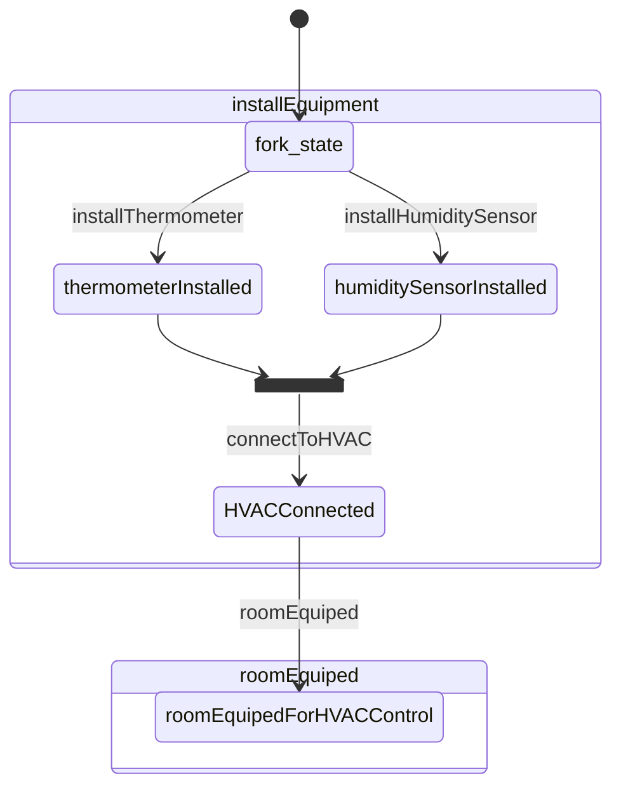

```mermaid
stateDiagram-v2


    [*] --> fork_state

    state installEquipment {
        state fork_state <<fork>>
        fork_state --> thermometerInstalled : installThermometer
        fork_state --> humiditySensorInstalled : installHumiditySensor

        state join_state <<join>>
        thermometerInstalled --> join_state
        humiditySensorInstalled --> join_state
        join_state --> HVACConnected : connectToHVAC

        HVACConnected --> roomEquipedForHVACControl : roomEquiped
    }

    state roomEquiped {
        roomEquipedForHVACControl
    }
```
  
