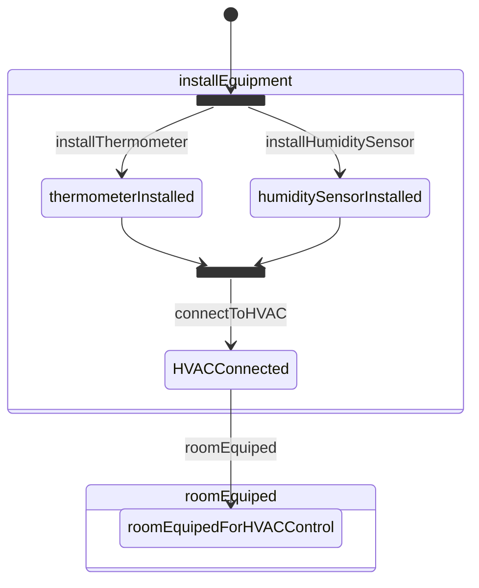

  
## 1. reasonJourneyLevelSteps

Lists the journey steps and the predicates of the required / produced states.

Example produced state's predicates:
```
(?t_0 ex:hasHVAC) e:skolem ?U_3.
```

Example required state's predicates:
```
?t_0 ex:hasHVAC ?U_3.
```

Input:
- data:
  - `rules/oslo-steps/step-reasoning.n3`
  - `rules/util/list.n3`
  - `rules/shacl/createPattern.n3`
  - `steps.ttl`
  - `states.ttl`
  - `shapes.ttl`
- query: `rules/oslo-steps/query_journeyStepToGPSDescription.n3`

Output: `steps_journey_level.n3`:

```
{
    :movemap gps:description (true true {
        ?t_0 ex:hasThermometer ?U_1.
        ?t_0 ex:hasHumiditySensor ?U_2.
        ?t_0 ex:hasHVAC ?U_3.
    } step:installEquipment 100 100 0.9 0.9).
} <= {
    (?t_0 ex:hasThermometer) e:skolem ?U_1.
    (?t_0 ex:hasHumiditySensor) e:skolem ?U_2.
    (?t_0 ex:hasHVAC) e:skolem ?U_3.
    ?t_0 a o-persoon:Inwoner.
}.
{
    :movemap gps:description (true true {
        ?t_0 ex:roomEquipedForHVACControl ?U_0.
    } step:roomEquiped 100 100 0.9 0.9).
} <= {
    ?t_0 ex:hasThermometer ?U_1.
    ?t_0 ex:hasHumiditySensor ?U_2.
    ?t_0 ex:hasHVAC ?U_3.
    (?t_0 ex:roomEquipedForHVACControl) e:skolem ?U_0.
    ?t_0 a o-persoon:Inwoner.
}.
```

## 2. reasonJourneyGoal

Given the goal state, what is the goal *path*? 

Intput:
- data:
  - `rules/oslo-steps/step-reasoning.n3`
  - `rules/util/list.n3`
  - `rules/shacl/createPattern.n3`
  - `steps.ttl`
  - `states.ttl`
  - `shapes.ttl`
  - `goal_journey_state.n3` (input are goal states)
- query: `rules/oslo-steps/query_journeyGoalToGPSPath.n3`

Example goal_journey_state:

```turtle
<http://localhost:8000/states#roomEquipedForHVACControl> a <https://example.org/ns/example#goalState> .
```

Output: goal_journey.n3

```
{
    ?U_7 gps:findpath ({
        ?t_0 ex:roomEquipedForHVACControl ?U_0.
    } ?U_8 ?U_9 ?U_10 ?U_11 ?U_12 (1000 1000 0.2 0.2)).
} => {
    ?t_0 gps:path (?U_8 ?U_9 ?U_10 ?U_11 ?U_12).
}.
```

## 3. reasonShortStepDescriptions (Journey level)

Find out what this does...

Input:
- data:
  - `_output/bocemon_example/steps_journey_level.n3` (the known journey level steps)
  - `scenarios/knowledge.n3` (business rules? is it used atm?)
- query: `rules/workflow-composer/preselection/pregeneration.n3`

Output: `_output/bocemon_example/short_step_descriptions_journey.n3`

```
{
    {
        {
            (?U_0 ns1:hasThermometer) e:skolem ?U_1.
            (?U_0 ns1:hasHumiditySensor) e:skolem ?U_2.
            (?U_0 ns1:hasHVAC) e:skolem ?U_3.
            ?U_0 a o-persoon:Inwoner.
        } step:installEquipment {
            ?U_0 ns1:hasThermometer ?U_1.
            ?U_0 ns1:hasHumiditySensor ?U_2.
            ?U_0 ns1:hasHVAC ?U_3.
        }.
    } a :ShortDescription.
} <= true.
{
    {
        {
            ?U_4 ns1:hasThermometer ?U_6.
            ?U_4 ns1:hasHumiditySensor ?U_7.
            ?U_4 ns1:hasHVAC ?U_8.
            (?U_4 ns1:roomEquipedForHVACControl) e:skolem ?U_5.
            ?U_4 a o-persoon:Inwoner.
        } step:roomEquiped {
            ?U_4 ns1:roomEquipedForHVACControl ?U_5.
        }.
    } a :ShortDescription.
} <= true.
{
    _:sk_9 ex:paperWorkForMovementComplete true.
} :reliesOn {
    _:sk_9 ex:wasteCollectionRequested true.
}.
{
    {
        ?U_9 ex:paperWorkForMovementComplete true.
    } :reliesOn {
        ?U_9 ex:wasteCollectionRequested true.
    }.
} <= true.
{
    _:sk_13 ex:paperWorkForMovementComplete true.
} :reliesOn {
    _:sk_13 ex:addressChangeDeclared true.
}.
{
    {
        ?U_13 ex:paperWorkForMovementComplete true.
    } :reliesOn {
        ?U_13 ex:addressChangeDeclared true.
    }.
} <= true.
{
    _:sk_17 ex:paperWorkForMovementComplete true.
} :reliesOn {
    _:sk_17 ex:transportRequested _:sk_18.
}.
{
    {
        ?U_17 ex:paperWorkForMovementComplete true.
    } :reliesOn {
        ?U_17 ex:transportRequested ?U_18.
    }.
} <= true.
{
    _:sk_21 ex:paperWorkForMovementComplete true.
} :reliesOn {
    _:sk_21 ex:mobilityRequested _:sk_23.
}.
{
    {
        ?U_21 ex:paperWorkForMovementComplete true.
    } :reliesOn {
        ?U_21 ex:mobilityRequested ?U_23.
    }.
} <= true.
{
    _:sk_25 ex:paperWorkForMovementComplete true.
} :reliesOn {
    _:sk_25 ex:drivingLicenceExchangeRequested _:sk_28.
}.
{
    {
        ?U_25 ex:paperWorkForMovementComplete true.
    } :reliesOn {
        ?U_25 ex:drivingLicenceExchangeRequested ?U_28.
    }.
} <= true.
{
    _:sk_29 ex:providedFamilyInformation true.
} :reliesOn {
    _:sk_29 ex:numberOfFamilyMembers 1.
}.
{
    {
        ?U_29 ex:providedFamilyInformation true.
    } :reliesOn {
        ?U_29 ex:numberOfFamilyMembers 1.
    }.
} <= true.
{
    _:sk_30 ex:providedFamilyInformation true.
} :reliesOn {
    _:sk_32 e:findall (_:sk_33 {
        _:sk_30 ex:familyMember _:sk_33.
    } _:sk_34).
}.
{
    {
        ?U_30 ex:providedFamilyInformation true.
    } :reliesOn {
        ?U_32 e:findall (?U_33 {
            ?U_30 ex:familyMember ?U_33.
        } ?U_34).
    }.
} <= true.
{
    _:sk_36 ex:providedFamilyInformation true.
} :reliesOn {
    _:sk_40 e:length _:sk_41.
}.
{
    {
        ?U_36 ex:providedFamilyInformation true.
    } :reliesOn {
        ?U_40 e:length ?U_41.
    }.
} <= true.
{
    _:sk_42 ex:providedFamilyInformation true.
} :reliesOn {
    (_:sk_47 _:sk_43) math:difference 1.
}.
{
    {
        ?U_42 ex:providedFamilyInformation true.
    } :reliesOn {
        (?U_47 ?U_43) math:difference 1.
    }.
} <= true.
{
    _:sk_48 ex:providedFamilyInformation true.
} :reliesOn {
    _:sk_49 e:label _:sk_50.
}.
{
    {
        ?U_48 ex:providedFamilyInformation true.
    } :reliesOn {
        ?U_49 e:label ?U_50.
    }.
} <= true.
{
    _:sk_52 ex:providedFamilyInformation true.
} :reliesOn {
    _:sk_52 ex:familyMember _:sk_55.
}.
{
    {
        ?U_52 ex:providedFamilyInformation true.
    } :reliesOn {
        ?U_52 ex:familyMember ?U_55.
    }.
} <= true.
{
    _:sk_56 ex:providedGreenWasteInformation true.
} :reliesOn {
    _:sk_56 ex:needForGreenWasteContainer _:sk_57.
}.
{
    {
        ?U_56 ex:providedGreenWasteInformation true.
    } :reliesOn {
        ?U_56 ex:needForGreenWasteContainer ?U_57.
    }.
} <= true.
{
    _:sk_62 ex:providedGreenWasteInformation true.
} :reliesOn {
    _:sk_62 ex:numberOfRequested40LiterGreenWasteContainers _:sk_64.
}.
{
    {
        ?U_62 ex:providedGreenWasteInformation true.
    } :reliesOn {
        ?U_62 ex:numberOfRequested40LiterGreenWasteContainers ?U_64.
    }.
} <= true.
{
    _:sk_68 ex:providedGreenWasteInformation true.
} :reliesOn {
    _:sk_68 ex:numberOfRequested120LiterGreenWasteContainers _:sk_71.
}.
{
    {
        ?U_68 ex:providedGreenWasteInformation true.
    } :reliesOn {
        ?U_68 ex:numberOfRequested120LiterGreenWasteContainers ?U_71.
    }.
} <= true.
{
    _:sk_74 ex:providedGreenWasteInformation true.
} :reliesOn {
    _:sk_74 ex:stopGreeWasteContainer _:sk_78.
}.
{
    {
        ?U_74 ex:providedGreenWasteInformation true.
    } :reliesOn {
        ?U_74 ex:stopGreeWasteContainer ?U_78.
    }.
} <= true.
{
    _:sk_80 ex:providedGreenWasteInformation true.
} :reliesOn {
    _:sk_80 ex:lockNeededForGreenWasteContainer _:sk_85.
}.
{
    {
        ?U_80 ex:providedGreenWasteInformation true.
    } :reliesOn {
        ?U_80 ex:lockNeededForGreenWasteContainer ?U_85.
    }.
} <= true.
{
    _:sk_86 ex:providedGreenWasteInformation true.
} :reliesOn {
    _:sk_86 ex:needForGreenWasteContainer false.
}.
{
    {
        ?U_86 ex:providedGreenWasteInformation true.
    } :reliesOn {
        ?U_86 ex:needForGreenWasteContainer false.
    }.
} <= true.
{
    ex:movemap gps:description (true true {
        _:sk_87 ns1:hasThermometer _:sk_88.
        _:sk_87 ns1:hasHumiditySensor _:sk_89.
        _:sk_87 ns1:hasHVAC _:sk_90.
    } step:installEquipment 100 100 0.9 0.9).
} :reliesOn {
    (_:sk_87 ns1:hasThermometer) e:skolem _:sk_88.
}.
{
    {
        ex:movemap gps:description (true true {
            ?U_87 ns1:hasThermometer ?U_88.
            ?U_87 ns1:hasHumiditySensor ?U_89.
            ?U_87 ns1:hasHVAC ?U_90.
        } step:installEquipment 100 100 0.9 0.9).
    } :reliesOn {
        (?U_87 ns1:hasThermometer) e:skolem ?U_88.
    }.
} <= true.
{
    ex:movemap gps:description (true true {
        _:sk_91 ns1:hasThermometer _:sk_92.
        _:sk_91 ns1:hasHumiditySensor _:sk_93.
        _:sk_91 ns1:hasHVAC _:sk_94.
    } step:installEquipment 100 100 0.9 0.9).
} :reliesOn {
    (_:sk_91 ns1:hasHumiditySensor) e:skolem _:sk_93.
}.
{
    {
        ex:movemap gps:description (true true {
            ?U_91 ns1:hasThermometer ?U_92.
            ?U_91 ns1:hasHumiditySensor ?U_93.
            ?U_91 ns1:hasHVAC ?U_94.
        } step:installEquipment 100 100 0.9 0.9).
    } :reliesOn {
        (?U_91 ns1:hasHumiditySensor) e:skolem ?U_93.
    }.
} <= true.
{
    ex:movemap gps:description (true true {
        _:sk_95 ns1:hasThermometer _:sk_96.
        _:sk_95 ns1:hasHumiditySensor _:sk_97.
        _:sk_95 ns1:hasHVAC _:sk_98.
    } step:installEquipment 100 100 0.9 0.9).
} :reliesOn {
    (_:sk_95 ns1:hasHVAC) e:skolem _:sk_98.
}.
{
    {
        ex:movemap gps:description (true true {
            ?U_95 ns1:hasThermometer ?U_96.
            ?U_95 ns1:hasHumiditySensor ?U_97.
            ?U_95 ns1:hasHVAC ?U_98.
        } step:installEquipment 100 100 0.9 0.9).
    } :reliesOn {
        (?U_95 ns1:hasHVAC) e:skolem ?U_98.
    }.
} <= true.
{
    ex:movemap gps:description (true true {
        _:sk_99 ns1:hasThermometer _:sk_100.
        _:sk_99 ns1:hasHumiditySensor _:sk_101.
        _:sk_99 ns1:hasHVAC _:sk_102.
    } step:installEquipment 100 100 0.9 0.9).
} :reliesOn {
    _:sk_99 a o-persoon:Inwoner.
}.
{
    {
        ex:movemap gps:description (true true {
            ?U_99 ns1:hasThermometer ?U_100.
            ?U_99 ns1:hasHumiditySensor ?U_101.
            ?U_99 ns1:hasHVAC ?U_102.
        } step:installEquipment 100 100 0.9 0.9).
    } :reliesOn {
        ?U_99 a o-persoon:Inwoner.
    }.
} <= true.
{
    ex:movemap gps:description (true true {
        _:sk_103 ns1:roomEquipedForHVACControl _:sk_107.
    } step:roomEquiped 100 100 0.9 0.9).
} :reliesOn {
    _:sk_103 ns1:hasThermometer _:sk_104.
}.
{
    {
        ex:movemap gps:description (true true {
            ?U_103 ns1:roomEquipedForHVACControl ?U_107.
        } step:roomEquiped 100 100 0.9 0.9).
    } :reliesOn {
        ?U_103 ns1:hasThermometer ?U_104.
    }.
} <= true.
{
    ex:movemap gps:description (true true {
        _:sk_108 ns1:roomEquipedForHVACControl _:sk_112.
    } step:roomEquiped 100 100 0.9 0.9).
} :reliesOn {
    _:sk_108 ns1:hasHumiditySensor _:sk_110.
}.
{
    {
        ex:movemap gps:description (true true {
            ?U_108 ns1:roomEquipedForHVACControl ?U_112.
        } step:roomEquiped 100 100 0.9 0.9).
    } :reliesOn {
        ?U_108 ns1:hasHumiditySensor ?U_110.
    }.
} <= true.
{
    ex:movemap gps:description (true true {
        _:sk_113 ns1:roomEquipedForHVACControl _:sk_117.
    } step:roomEquiped 100 100 0.9 0.9).
} :reliesOn {
    _:sk_113 ns1:hasHVAC _:sk_116.
}.
{
    {
        ex:movemap gps:description (true true {
            ?U_113 ns1:roomEquipedForHVACControl ?U_117.
        } step:roomEquiped 100 100 0.9 0.9).
    } :reliesOn {
        ?U_113 ns1:hasHVAC ?U_116.
    }.
} <= true.
{
    ex:movemap gps:description (true true {
        _:sk_118 ns1:roomEquipedForHVACControl _:sk_122.
    } step:roomEquiped 100 100 0.9 0.9).
} :reliesOn {
    (_:sk_118 ns1:roomEquipedForHVACControl) e:skolem _:sk_122.
}.
{
    {
        ex:movemap gps:description (true true {
            ?U_118 ns1:roomEquipedForHVACControl ?U_122.
        } step:roomEquiped 100 100 0.9 0.9).
    } :reliesOn {
        (?U_118 ns1:roomEquipedForHVACControl) e:skolem ?U_122.
    }.
} <= true.
{
    ex:movemap gps:description (true true {
        _:sk_123 ns1:roomEquipedForHVACControl _:sk_127.
    } step:roomEquiped 100 100 0.9 0.9).
} :reliesOn {
    _:sk_123 a o-persoon:Inwoner.
}.
{
    {
        ex:movemap gps:description (true true {
            ?U_123 ns1:roomEquipedForHVACControl ?U_127.
        } step:roomEquiped 100 100 0.9 0.9).
    } :reliesOn {
        ?U_123 a o-persoon:Inwoner.
    }.
} <= true.
```

## 4. reasonSelectedSteps (journey)

List *selected* journey level steps

Input:
- data:
  - `_output/bocemon_example/steps_journey_level.n3 (reasonJourneyLevelSteps)`
  - `_output/bocemon_example/goal_journey.n3 (reasonJourneyGoal)`
  - `_output/bocemon_example/short_step_descriptions_journey.n3 (reasonShortStepDescriptions)`
  - `rules/workflow-composer/preselection/preselection.n3`
  - `scenarios/knowledge.n3`
- query: `rules/oslo-steps/query_journeyStepToGPSDescription.n3`

Output: `_output/bocemon_example/selected_steps_journey_journey.n3`

```
{
    ex:movemap gps:description (true true {
        ?U_12 ns1:roomEquipedForHVACControl ?U_13.
    } step:roomEquiped 100 100 0.9 0.9).
} <= {
    ?U_12 ns1:hasThermometer ?U_14.
    ?U_12 ns1:hasHumiditySensor ?U_15.
    ?U_12 ns1:hasHVAC ?U_16.
    (?U_12 ns1:roomEquipedForHVACControl) e:skolem ?U_13.
    ?U_12 a o-persoon:Inwoner.
}.
{
    ex:movemap gps:description (true true {
        ?U_17 ns1:hasThermometer ?U_18.
        ?U_17 ns1:hasHumiditySensor ?U_19.
        ?U_17 ns1:hasHVAC ?U_20.
    } step:installEquipment 100 100 0.9 0.9).
} <= {
    (?U_17 ns1:hasThermometer) e:skolem ?U_18.
    (?U_17 ns1:hasHumiditySensor) e:skolem ?U_19.
    (?U_17 ns1:hasHVAC) e:skolem ?U_20.
    ?U_17 a o-persoon:Inwoner.
}.
```

## 5. reasonJourney

Lists journey level steps, in order.

Function *parsePaths* is used to put them in an array.

Input:
- data:
  - `_output/bocemon_example/selected_steps_journey_journey.n3` (reasonSelectedSteps)
  - `steps.ttl`
  - `_output/bocemon_example/profile.ttl`
  - `rules/workflow-composer/gps-plugin_modified_noPermutations.n3`
  - `scenarios/knowledge.n3`
- query: `_output/bocemon_example/goal_journey.n3` (reasonJourneyGoal)

Output: `_output/bocemon_example/reason_journey.n3`

```
ex:user gps:path ((("unorderedList" (step:installEquipment)) step:roomEquiped) 200.0 200.0 0.81 0.81).
```

Then a loop iterates over the journey level step IRIs

### 5.1 reasonContainerLevelSteps

Same as *reasonJourneyLevelSteps*, but then on container level.


Input:
- data:
  - `rules/oslo-steps/step-reasoning.n3`
  - `rules/util/list.n3`
  - `rules/shacl/createPattern.n3`
  - `steps.ttl`
  - `states.ttl`
  - `shapes.ttl`
- query: `query_containerStepToGPSDescription.n3`

Output: `_output/bocemon_example/steps_container_level.n3`:

```
{
    :movemap gps:description (true true {
        ?t_0 ex:hasThermometer ?U_1.
        ?t_0 ex:hasHumiditySensor ?U_2.
        ?t_0 ex:hasHVAC ?U_3.
    } step:installEquipment 10 10 0.9 0.9).
} <= {
    (?t_0 ex:hasThermometer) e:skolem ?U_1.
    (?t_0 ex:hasHumiditySensor) e:skolem ?U_2.
    (?t_0 ex:hasHVAC) e:skolem ?U_3.
    ?t_0 a o-persoon:Inwoner.
}.
{
    :movemap gps:description (true true {
        ?t_0 ex:roomEquipedForHVACControl ?U_0.
    } step:roomEquiped 10 10 0.9 0.9).
} <= {
    ?t_0 ex:hasThermometer ?U_1.
    ?t_0 ex:hasHumiditySensor ?U_2.
    ?t_0 ex:hasHVAC ?U_3.
    (?t_0 ex:roomEquipedForHVACControl) e:skolem ?U_0.
    ?t_0 a o-persoon:Inwoner.
}.
{
    :movemap gps:description (true true {
        ?t_0 ex:hasHVAC ?U_3.
    } step:connectToHVAC 10 10 0.9 0.9).
} <= {
    ?t_0 ex:hasThermometer ?U_1.
    ?t_0 ex:hasHumiditySensor ?U_2.
    (?t_0 ex:hasHVAC) e:skolem ?U_3.
    ?t_0 a o-persoon:Inwoner.
}.
```

### 5.2 reasonShortStepDescriptions (container level steps)

TODO: figure out what exactly

### 5.3 reasonStep (container level)

Input:
- parentLevelStep: IRI node of journey level step, e.g.: `http://localhost:8000/steps#installEquipment`
- stepsPath: `_output/bocemon_example/steps_container_level.n3` (reasonContainerLevelSteps)
- descriptionsPath: `_output/bocemon_example/short_step_descriptions_container.n3` (reasonShortStepDescriptions)
- parentStepsPath: `_output/bocemon_example/steps_journey_level.n3` (reasonJourneyLevelSteps)
- config: contains label, shapes, steps, states, goal state, personal info
- type: `containers` (indicates level)
- index: all data to write in index.json file?

#### 5.3.1 generateSelected

Tells to find a sub path of the selected **parent** level step, in this case a journey level step.

Input:
- parentLevelStep, e.g.: `http://localhost:8000/steps#installEquipment`
- baseFolder
- parentStepName, e.g.: `installEquipment`
- type: `containers`

Output: `_output/bocemon_example/select_containers_installEquipment.n3`

```turtle
<http://localhost:8000/steps#installEquipment> :findSubpath true.
```

#### 5.3.2 reasonBlock

Finds all predicates of the container level states that have to be present, 
i.e. that *block* the current parent (journey) level step.

Input:
- data:
  - parentSelectedPath, e.g.: `_output/bocemon_example/select_containers_installEquipment.n3` (generateSelected)
  - parentStepsPath, e.g.: `_output/bocemon_example/steps_journey_level.n3` (reasonJourneyLevelSteps)
  - parentStepName, e.g.: `installEquipment`
  - type: `containers`
- query: `rules/workflow-composer/subgoals/query_creationOfBlockingInfo.n3`

Output: `_output/bocemon_example/block_containers_installEquipment.n3`

```
{
    (<http://www.w3.org/2000/10/swap/var#x_0> ex:hasHVAC) e:skolem <http://www.w3.org/2000/10/swap/var#x_3>.
} :inInputRule true.
{
    (<http://www.w3.org/2000/10/swap/var#x_0> ex:hasHumiditySensor) e:skolem <http://www.w3.org/2000/10/swap/var#x_2>.
} :inInputRule true.
{
    (<http://www.w3.org/2000/10/swap/var#x_0> ex:hasThermometer) e:skolem <http://www.w3.org/2000/10/swap/var#x_1>.
} :inInputRule true.
{
    <http://www.w3.org/2000/10/swap/var#x_0> a o-persoon:Inwoner.
} :inInputRule true.
```

#### 5.3.2 reasonGoal

Predicates of substates required to reach goal.

Input:
- data:
  - parentSelectedPath, e.g.: `_output/bocemon_example/select_containers_installEquipment.n3` (generateSelected)
  - parentStepsPath, e.g.: `_output/bocemon_example/steps_journey_level.n3` (reasonJourneyLevelSteps)
  - parentStepName, e.g.: `installEquipment`
  - type: `containers`
- query: `rules/workflow-composer/subgoals/query_subgoalCreation.n3`

Output: `_output/bocemon_example/goal_containers_installEquipment.n3`

```
{
    ?t_0 gps:findpath ({
        ?U_0 ex:hasThermometer ?U_1.
        ?U_0 ex:hasHumiditySensor ?U_2.
        ?U_0 ex:hasHVAC ?U_3.
    } ?t_1 ?t_2 ?t_3 ?t_4 ?t_5 (100 100 0.2 0.2)).
} => {
    _:t_6 gps:path (?t_1 ?t_2 ?t_3 ?t_4 ?t_5).
}.
```

#### 5.3.3 reasonExtraRule

Not sure what this does.

Input:
- data:
  - parentSelectedPath, e.g.: `_output/bocemon_example/select_containers_installEquipment.n3` (generateSelected)
  - parentStepsPath, e.g.: `_output/bocemon_example/steps_journey_level.n3` (reasonJourneyLevelSteps)
  - parentStepName, e.g.: `installEquipment`
  - type: `containers`
- query: `rules/workflow-composer/query_creationOfRuleForMissingData.n3`

Output: `_output/bocemon_example/extra_rule_containers_installEquipment.n3`

#### 5.3.4 reasonSelectedSteps (container)

See [reasonSelectedSteps (journey)](#4-reasonselectedsteps-journey), but then on container level.

Then, write everything from above steps to index file.

Output: selectedStepsPath, e.g. `_output/bocemon_example/selected_steps_containers_installEquipment.n3`

#### 5.3.4 _reasonPaths

Input:
- data:
  - selectedStepsPath, e.g.: `_output/bocemon_example/selected_steps_containers_installEquipment.n3`
  - `steps.ttl`
  - `_output/bocemon_example/profile.ttl`
  - parentExtraRulePath, e.g.: `_output/bocemon_example/extra_rule_containers_installEquipment.n3`
  - parentStepName, e.g.: `installEquipment`
  - type: `containers`
  - `rules/workflow-composer/gps-plugin_modified_noPermutations.n3`
  - `scenarios/knowledge.n3`
  - `rules/util/graph.n3`
- query: parentGoalPath, e.g.: `_output/bocemon_example/goal_containers_installEquipment.n3` 

Output: `_output/bocemon_example/reason_paths_containers_installEquipment.n3`

```
_:sk_3 gps:path ((("unorderedList" (step:installEquipment))) 10.0 10.0 0.9 0.9).
```

** For every container level step:**

## 5.4 reasonComponentLevelSteps

Same as *reasonJourneyLevelSteps*, but then on container level.

Input:
- data:
  - `rules/oslo-steps/step-reasoning.n3`
  - `rules/util/list.n3`
  - `rules/shacl/createPattern.n3`
  - `steps.ttl`
  - `states.ttl`
  - `shapes.ttl`
- query: `query_componentStepToGPSDescription.n3`

Output: `_output/bocemon_example/steps_component_level.n3`:

**Same for component level steps next...**
