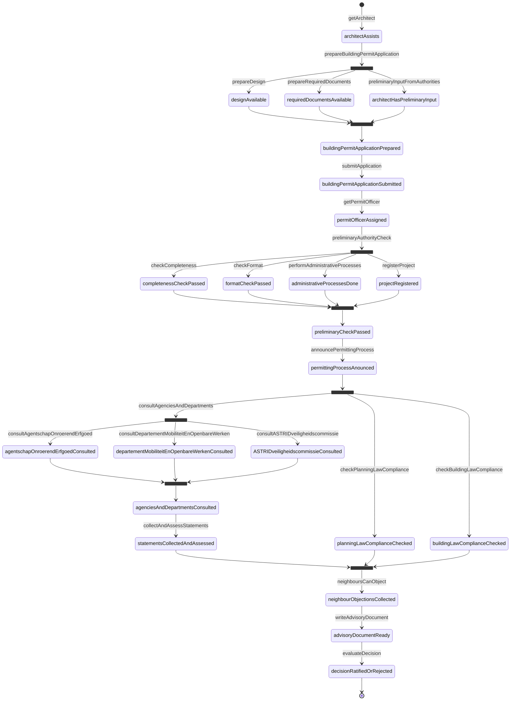

```mermaid
---
config:
  theme: default
---
stateDiagram
  direction TB
  state fork_state1 <<fork>>
  state join_state1 <<join>>
  state fork_state2 <<fork>>
  state join_state2 <<join>>
  state fork_state3 <<fork>>
  state fork_state4 <<fork>>
  state join_state4 <<join>>
  state join_state3 <<join>>
  [*] --> architectAssists:getArchitect
  architectAssists --> fork_state1:prepareBuildingPermitApplication
  fork_state1 --> designAvailable:prepareDesign
  fork_state1 --> requiredDocumentsAvailable:prepareRequiredDocuments
  fork_state1 --> architectHasPreliminaryInput:preliminaryInputFromAuthorities
  designAvailable --> join_state1
  requiredDocumentsAvailable --> join_state1
  architectHasPreliminaryInput --> join_state1
  join_state1 --> buildingPermitApplicationPrepared
  buildingPermitApplicationPrepared --> buildingPermitApplicationSubmitted:submitApplication
  buildingPermitApplicationSubmitted --> permitOfficerAssigned:getPermitOfficer
  permitOfficerAssigned --> fork_state2:preliminaryAuthorityCheck
  fork_state2 --> completenessCheckPassed:checkCompleteness
  fork_state2 --> formatCheckPassed:checkFormat
  fork_state2 --> administrativeProcessesDone:performAdministrativeProcesses
  fork_state2 --> projectRegistered:registerProject
  completenessCheckPassed --> join_state2
  formatCheckPassed --> join_state2
  administrativeProcessesDone --> join_state2
  projectRegistered --> join_state2
  join_state2 --> preliminaryCheckPassed
  preliminaryCheckPassed --> permittingProcessAnounced:announcePermittingProcess
  permittingProcessAnounced --> fork_state3
  fork_state3 --> fork_state4:consultAgenciesAndDepartments
  fork_state4 --> agency1:consultAgentschapOnroerendErfgoed
  fork_state4 --> agency2:consultDepartementMobiliteitEnOpenbareWerken
  fork_state4 --> agency3:consultASTRIDveiligheidscommissie
  agency1 --> join_state4
  agency2 --> join_state4
  agency3 --> join_state4
  join_state4 --> agenciesAndDepartmentsConsulted
  agenciesAndDepartmentsConsulted --> statementsCollectedAndAssessed:collectAndAssessStatements
  statementsCollectedAndAssessed --> join_state3
  fork_state3 --> planningLawComplianceChecked:checkPlanningLawCompliance
  fork_state3 --> buildingLawComplianceChecked:checkBuildingLawCompliance
  planningLawComplianceChecked --> join_state3
  buildingLawComplianceChecked --> join_state3
  join_state3 --> neighbourObjectionsCollected: neighboursCanObject
  neighbourObjectionsCollected --> advisoryDocumentReady: writeAdvisoryDocument
  advisoryDocumentReady --> decisionRatifiedOrRejected: evaluateDecision
  decisionRatifiedOrRejected --> [*]
  agency1:agentschapOnroerendErfgoedConsulted
  agency2:departementMobiliteitEnOpenbareWerkenConsulted
  agency3:ASTRIDveiligheidscommissieConsulted
```
