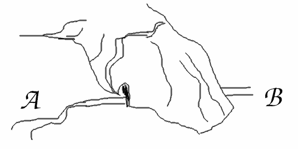
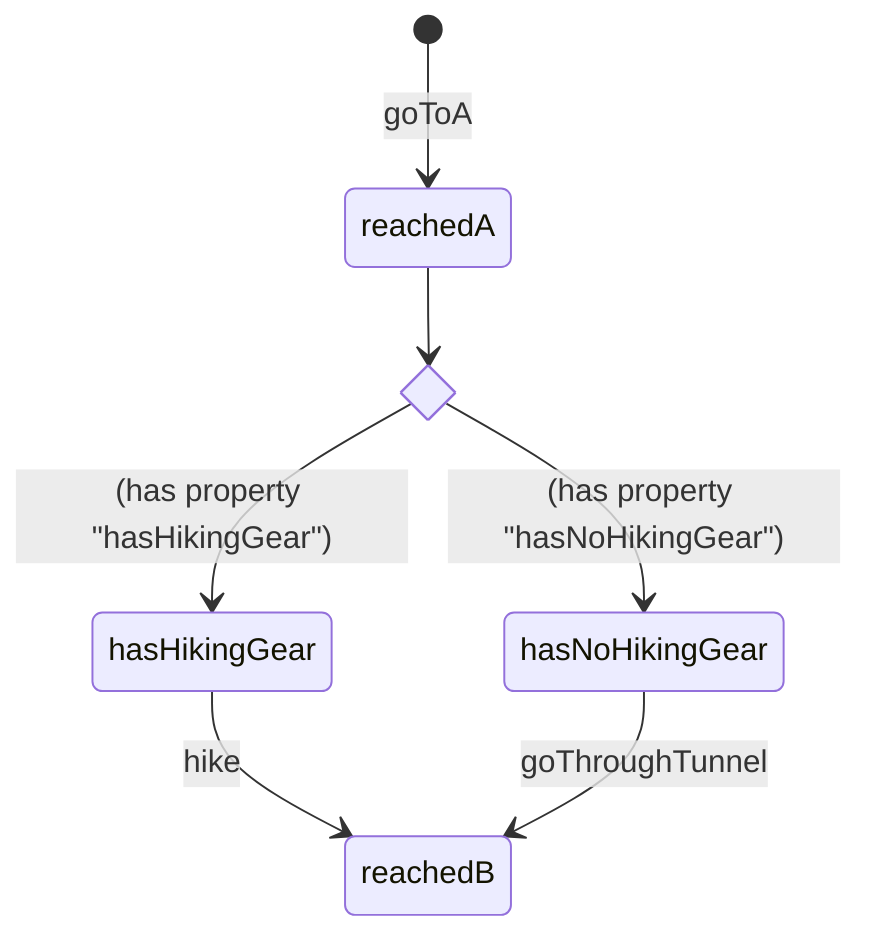

## Scenario with choice

Bob wants to go from A to B. Between A and B is a mountain.
Bob leaves home and goes to A.
Once he reached A, he sees a hiking trail going over the mountain to B,
but also a tunnel going through the mountain to B.

If Bob is equiped with the right hiking gear, he can take the trail.
If he has no hiking gear, he has to go through the boring tunnel.

In the end he reaches B anyway.

This scenario was generated with the tool `prepare-flow-mappings` from file `fromAToB.ods`
