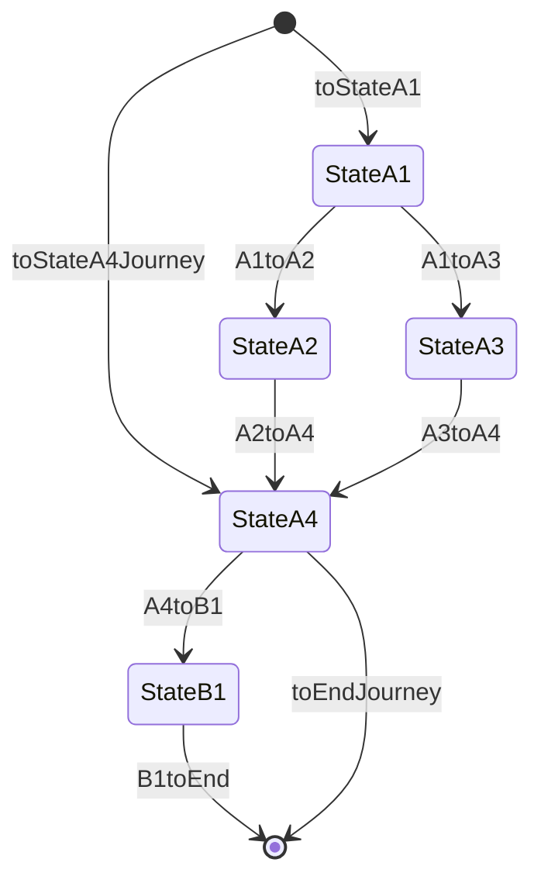

```mermaid
stateDiagram-v2

    [*] --> StateA1 : toStateA1
    [*] --> StateA4 : toStateA4Journey
    
    state StateA1 <<fork>>
    StateA1 --> StateA2 : A1toA2
    StateA1 --> StateA3 : A1toA3
    state StateA4 <<join>>
    StateA2 --> StateA4 : A2toA4
    StateA3 --> StateA4 : A3toA4
    StateA4 --> StateB1 : A4toB1
    
    StateB1 --> [*] : B1toEnd
    
    StateA4 --> [*] : toEndJourney

```
